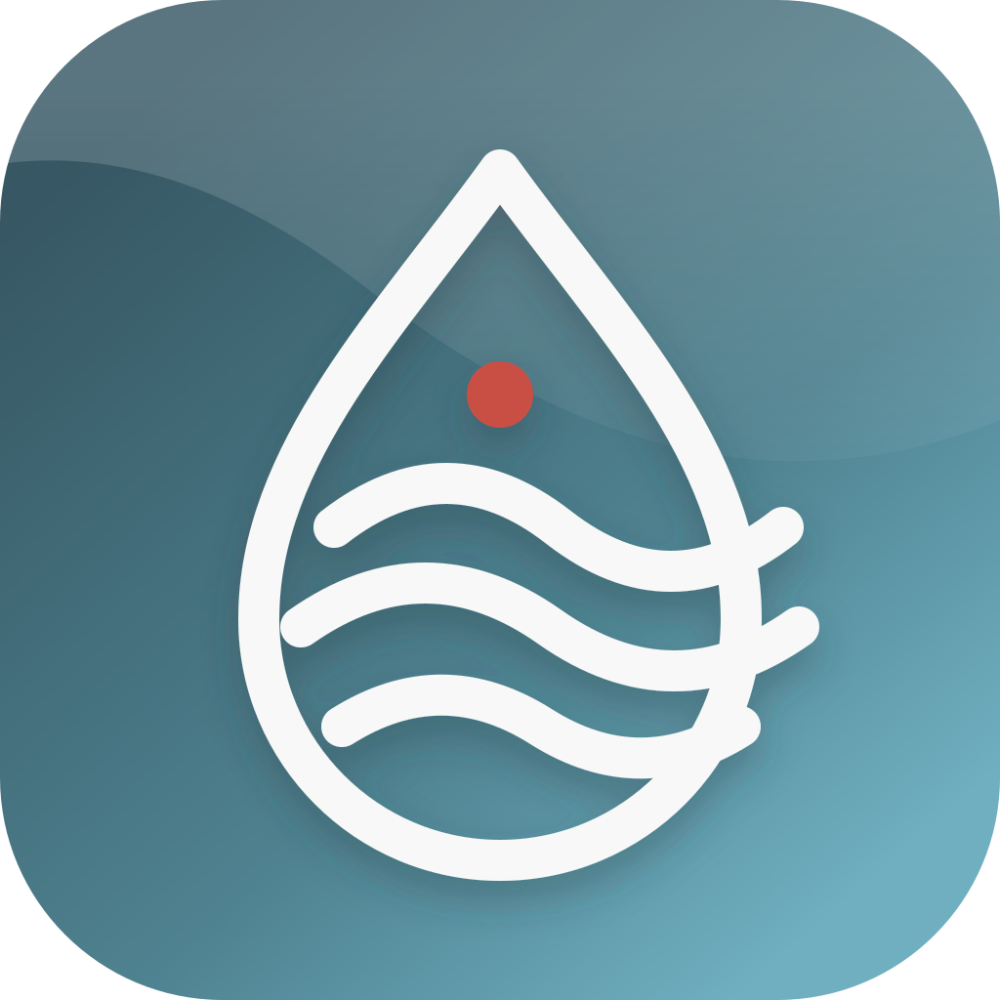
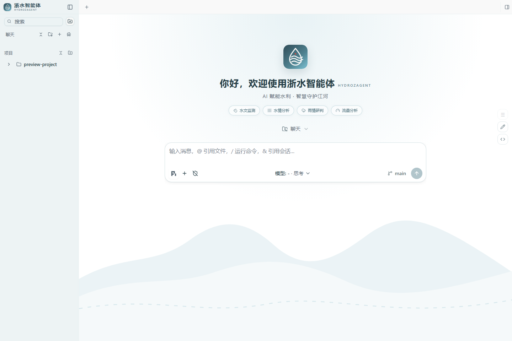

<p align="center">
  
</p>

<h1 align="center">浙水智能体 hydroZagent</h1>

<p align="center">AI 赋能水利 · 智慧守护江河</p>

浙水智能体是面向水利行业的一体化本地 Agent 产品。本仓库同时包含 Agent 核心、桌面工作台和局域网 Web 共享能力；桌面端不再作为独立 PiDeck 项目交付，而是整个产品的用户入口。



## 产品组成

| 层级 | 目录 | 职责 |
|---|---|---|
| 用户入口 | [`apps/desktop`](apps/desktop) | Electron 桌面工作台、项目和会话管理、水利品牌 UI、内网 Web 服务 |
| Agent 运行时 | [`packages/coding-agent`](packages/coding-agent) | 工具调用、会话执行、技能与扩展 |
| 模型与协议 | [`packages/ai`](packages/ai)、[`packages/agent`](packages/agent)、[`packages/protocol`](packages/protocol) | 模型接入、Agent 状态机与通信协议 |
| 服务能力 | [`packages/server`](packages/server)、[`packages/client`](packages/client) | 服务端与客户端通信基础 |

开发模式下，桌面端优先使用本仓库构建出的 `packages/coding-agent/dist/cli.js`。正式分发时，`desktop:dist` 会先构建当前平台的 Agent 可执行文件，再将它打进桌面应用，因此用户无需另外安装全局 `pi`。

详细边界见 [`docs/product-architecture.md`](docs/product-architecture.md)。
品牌视觉基准见 [`docs/brand/浙水智能体整体设计方案.png`](docs/brand/浙水智能体整体设计方案.png)。

## 开发

日常边使用边修改的完整流程见[《边使用边开发指南》](docs/iterative-development-guide.md)。

需要 Node.js 22.19 或更高版本。首次运行：

```bash
npm install --ignore-scripts
npm run desktop:install
npm run desktop:prepare
npm run desktop:dev
```

常用命令：

```bash
npm run check             # 检查 Agent 核心
npm run desktop:check     # 检查桌面端类型
npm run desktop:test      # 运行桌面端测试
npm run desktop:dist      # 构建包含 Agent 运行时的完整桌面发行版
```

## 当前水利适配

- 统一品牌名称、徽标、启动页和青碧朱砂视觉主题。
- 补充水文、水情、雨情、流量、水位、水库、河网、防汛和预警等中英文词条。
- 保留局域网 Web 服务，支持内网共享会话。
- 默认仅使用 Pi Agent 运行链路；DSH 和桌宠不进入产品入口与默认运行时。

## 开源说明

Agent 核心基于 Pi 社区代码持续演进；桌面工作台 fork 自 [PiDeck](https://github.com/ayuayue/PiDeck)。各部分沿用其对应的开源许可，详见仓库内 LICENSE 与贡献者文件。
